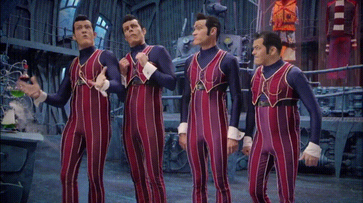
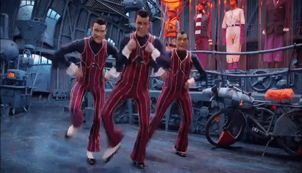

# **Don't let your kids watch it!**

### **spoiler:** profile does not contain nor vegan nor waifu nor christian materials

 

  

 

# **Are you a developer?**

 

  

 

## **Well... technically nah.**

Although I love PCs and technology in general, My hart still beats for **_physics_**.
_( as a matter of facts I am studying **Engineering Physics** in Milan)_

I am self-taught, still studying to become a Full-Stack developer

 

# **What technologies do you use?**

 

  

 

I can code both in Python and Javascript
 

These are my most used Tools/Framework

 

These are the tools/Framework that I am going to learn

 

These are the tools/Framework that I am **_never_** going to learn

  

 

  

 

## **Hey weirdo have a nice day!!**

 

  

 

 

  

 

